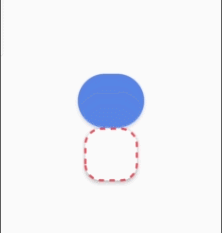
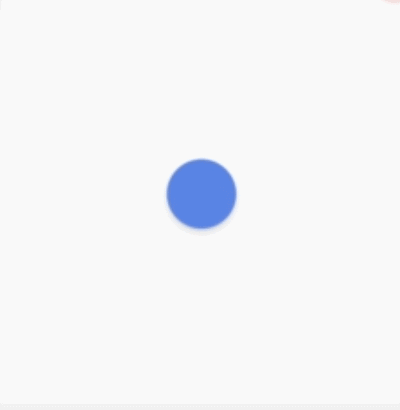
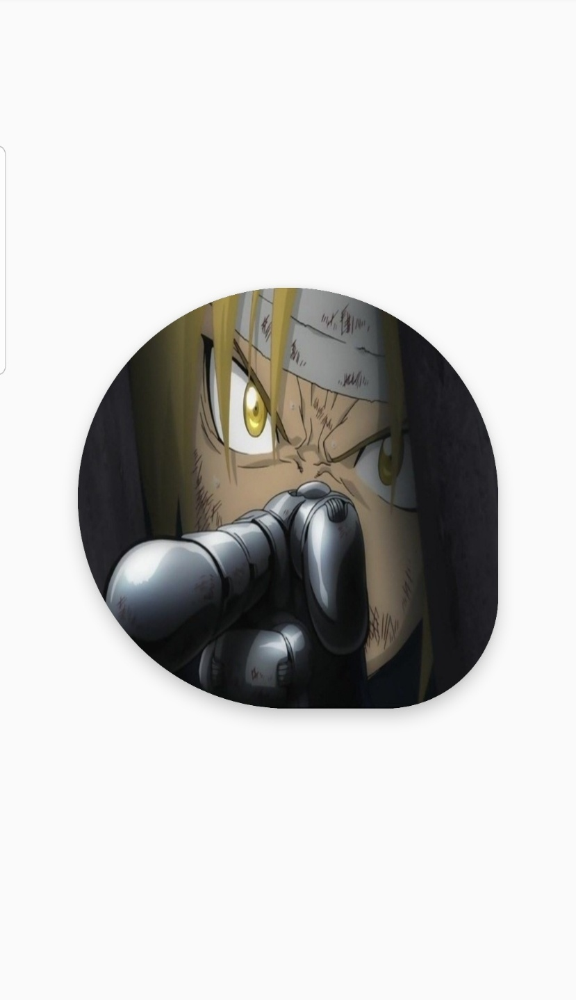
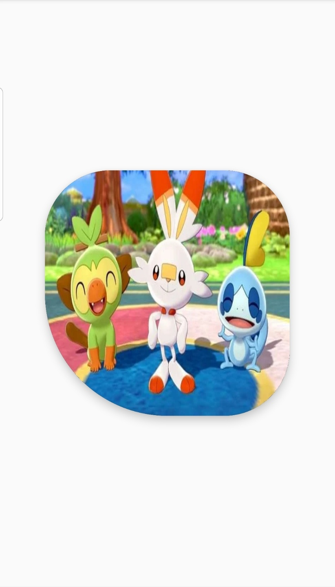
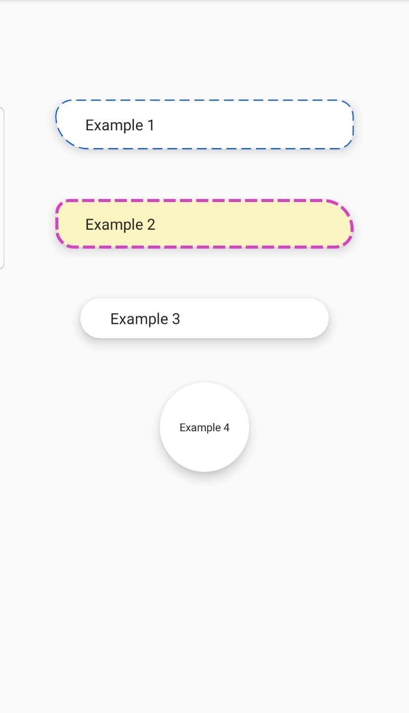
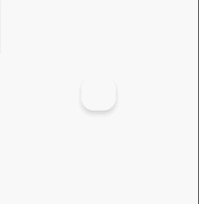

# RoundableLayout [](https://android-arsenal.com/details/1/7934) [](https://jitpack.io/#zladnrms/RoundableLayout)
 
When you implement a round corner layout, RoundableLayout is the best choice.

- Implemented ConstraintLayout 
- Support AndroidX
- Support round corner (clip children view default)
- Support background color 
- Support within MotionLayout
- Support within databinding

## Preview

#### within MotionLayout
         

#### Varius Customize
       

## What's New in _RoundableLayout_ 1.1.4?

- code fixed
- libray to open class (thx to rtsketo)
		
## Installation

* **Gradle**

Add it in your root build.gradle at the end of repositories:
```gradle
allprojects {
    repositories {
        maven { url 'https://www.jitpack.io' }
    }
}
```

Add the dependency in your app build.gradle
```gradle
dependencies {
    implementation 'androidx.constraintlayout:constraintlayout:2.0.0-beta1 or high' // if you want to use motion layout
    implementation 'com.github.zladnrms:RoundableLayout:1.1.4'
}

```
    
## How to use

### in .xml
#### The following attributes are optional.

```xml
   <com.tistory.zladnrms.roundablelayout.RoundableLayout
    android:id="@+id/layout_example"
    android:layout_width="300dp"
    android:layout_height="300dp"
    android:elevation="5dp" // native shadow options
    android:translationZ="5dp" // native shadow options
    app:backgroundColor="#FFFFFF" // if TRANSPARENT, shadow do not apply.
    app:cornerLeftTop="40dp"
    app:cornerRightTop="40dp"
    app:cornerLeftBottom="40dp"
    app:cornerRightBottom="40dp"
    app:strokeLineWidth="2dp"
    app:strokeLineColor="#222222"
    app:cornerLeftSide="25dp"
    app:cornerRightSide="25dp"
    app:dashLineWidth="10dp" // need stroke value 
    app:dashLineGap="4dp"> // need stroke value 
```

* `cornerLeftTop : Layout's left top round value. (default = 0dp)`
* `cornerRightTop : Layout's right top round value. (default = 0dp)`
* `cornerLeftBottom : Layout's left bottom round value. (default = 0dp)`
* `cornerRightBottom : Layout's right bottom round value. (default = 0dp)`
* `backgroundColor : Layout's background color value. (default = Color.WHITE)`
* `dashLineWidth : Layout outline dash width value. (default = 0dp)`
* `dashLineGap : Layout outline dash gap value. (default = 0dp)`
* `strokeLineWidth : Layout outline stroke width value. (default = 0dp)`
* `strokeLineColor : Layout outline stroke color value. (default = NULL)`

if greater than zero. side top and bottom corner value same this value.
* `cornerLeftSide : Layout's left side round value.  (default = 0dp)`
* `cornerRightSide : Layout's left side round value. (default = 0dp)`

the Side option is made in consideration of the custom attribute of motion layout.
because Constraint only has maximum two custom attribute. (now 2.0.0-beta2)

### Use example

[with dataBinding](https://github.com/zladnrms/RoundableLayout/blob/master/app/src/main/res/layout/activity_example.xml)


    
#### This example changes the background when a layout is clicked within MVVM Databinding.

[with MotionLayout](https://github.com/zladnrms/RoundableLayout/blob/master/app/src/main/res/layout/activity_motion_example.xml)


#### This example shows the use of animation through motionscene within motion layout.

# License

    Copyright 2019 Wookun Kim

    Licensed under the Apache License, Version 2.0 (the "License");
    you may not use this file except in compliance with the License.
    You may obtain a copy of the License at

        http://www.apache.org/licenses/LICENSE-2.0

    Unless required by applicable law or agreed to in writing, software
    distributed under the License is distributed on an "AS IS" BASIS,
    WITHOUT WARRANTIES OR CONDITIONS OF ANY KIND, either express or implied.
    See the License for the specific language governing permissions and
    limitations under the License.
